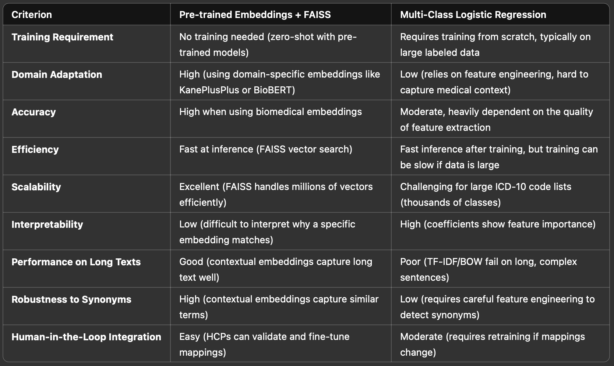
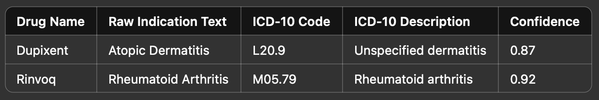

# Rx Copilot - Symptoms to Treatment Plan

A semantic journey from icd-10 codes to drug indications.

## Goal

To develop a fast and accurate method to classify patient symptoms to a set of medically-recognized conditions with associated FDA-approved drugs for treatment.

A baseline approach will involve selecting an off-the-shelf pre-trained model to generate embeddings for drug indications included in the DailyMed datasets to ICD-10 codes, using FAISS for efficient fuzzy search. The end goal is to support natural language queries that return embedded drug indications and their mapped ICD-10 codes with a confidence interval.

In the spirit of prototyping and domain exploration, let's address the core value proposition of creating a simple yet reliably performant lightweight set of embeddings for DailyMed that can be replicated and tuned further for deeper investigation and productionization.

### Outline

* **Data Extraction:** Scrape or parse publicly available drug label data from DailyMed.

* **Indication Identification & Normalization:** Extract sections of text that describe indications and standardize them ie handling synonyms, variations in labeling.

* **ICD-10 Mapping:** Attempt to link extracted indications to ICD-10 codes using an open-source ICD-10 dataset.

* **Prototype Implementation:** Build a minimal working prototype that takes a set of symptoms and yields a structured response qualifying the medical condition along with proposed drugs with indications.

* **Edge Case Handling:** Consider nuances such as:
    * Synonyms (e.g., "Hypertension" vs. "High Blood Pressure").
    * Multi-indication drugs.
    * Rare conditions that may not map neatly to ICD-10.

### Forward Thoughts

**Making Cluster Labels More Descriptive**

To go beyond basic clusters, we could:
- Store a representative text snippet (e.g. indication with highest similarity to centroid)
- Run BioBERT → GPT-style summarization to label cluster purpose
- Map each cluster to ICD-10 codes using our FAISS-based ICD index

---

## Approach

### Step 1: Data Acquisition and Loading

1.	Download DailyMed Datasets:

    - Use [DailyMed](https://dailymed.nlm.nih.gov/dailymed/spl-resources-all-drug-labels.cfm) RSS and bulk download APIs.

    - Download the “Structured Product Labeling” (SPL) files, which contain XML files for all approved drugs.

2.	Extract Relevant Sections:

    - Focus on Indications and Usage and Dosage and Administration.

	- Parse XML files using libraries like lxml or xml.etree.ElementTree.

3.	Store Data:
	- Save structured data (drug name, indications text) into an SQLite database for quick access and indexing.

### Step 2: Preprocessing and Embedding
1.	Text Preprocessing:
    - Remove stop words, special characters, and perform lemmatization.
	- Tokenization using spaCy or nltk.

2.	Generate Embeddings:
	- Use Hugging Face Transformers with pre-trained models (like sentence-transformers/all-MiniLM-L6-v2) to create sentence embeddings.

    - Store embeddings as vectors in a FAISS index.

### Step 3: ICD-10 Code Mapping
1.	Load ICD-10 Codes:
    - Download a structured ICD-10 dataset (CSV or TSV).
	- Embed ICD-10 description texts using the same model.
	- Store the ICD-10 embeddings in a separate FAISS index.

2.	Fuzzy Matching with FAISS:
	- When querying with a new drug label or symptom, compute the embedding.
	- Use FAISS nearest neighbor search to find the closest matches in the ICD-10 vector space.
	- Compute a confidence score based on cosine similarity.

### Step 4: Building the Query Pipeline
1.	Natural Language Query Handling:
	- Accept a text query from the user (e.g., a disease or indication).
	- Generate an embedding for the query using the same transformer model.

2.	Vector Search:
	- Query the FAISS index for the top K most similar ICD-10 embeddings.
	- Return the ICD-10 code, description, and confidence score.

### Step 5: Output Format

Display the results in a pandas DataFrame:

### Step 6: Evaluation and Optimization
1.	Accuracy Check:
	- Manually verify a few common drugs to validate accuracy.
	- Adjust the threshold and model selection if necessary.

2.	Performance Optimization:
	- Experiment with different embedding models (e.g., sentence-transformers/all-distilroberta-v1).
	- Tune FAISS parameters for faster nearest neighbor retrieval.

### Step 7: Productionization
1.	API with FastAPI:
	- Serve the model as a REST API for drug-indication mapping.
	- Endpoint: POST /map-indication with JSON payload containing indication text.

2.	Batch Processing:
	- Use Apache Spark or Dask for large-scale mapping.
	- Implement a data pipeline to regularly update the FAISS index with new SPL data.

### Step 8: Human-in-the-Loop (HITL) Validation
1.	MD/Pharmacist Review:
	- Include a step for manual validation of top-ranked matches.
	- Collect feedback to iteratively improve accuracy and update ICD-10 mappings.

2.	Continuous Learning:
	- Implement feedback loops where human-validated mappings update the FAISS index and embedding models.